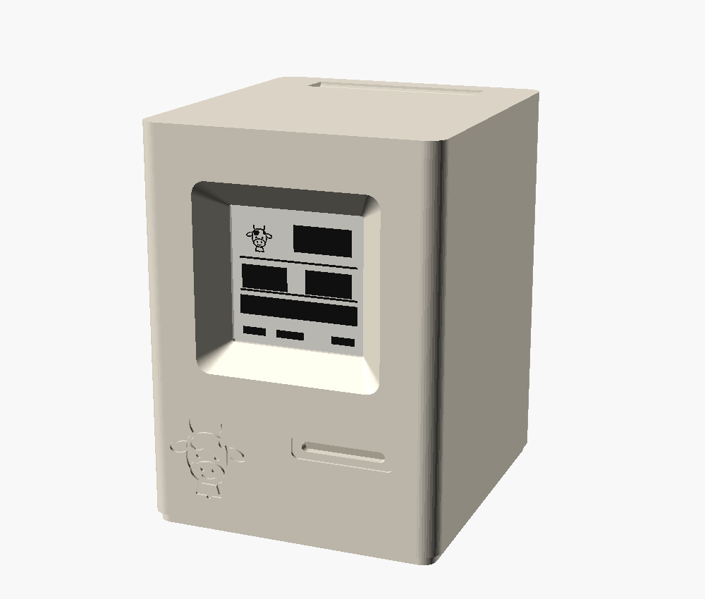
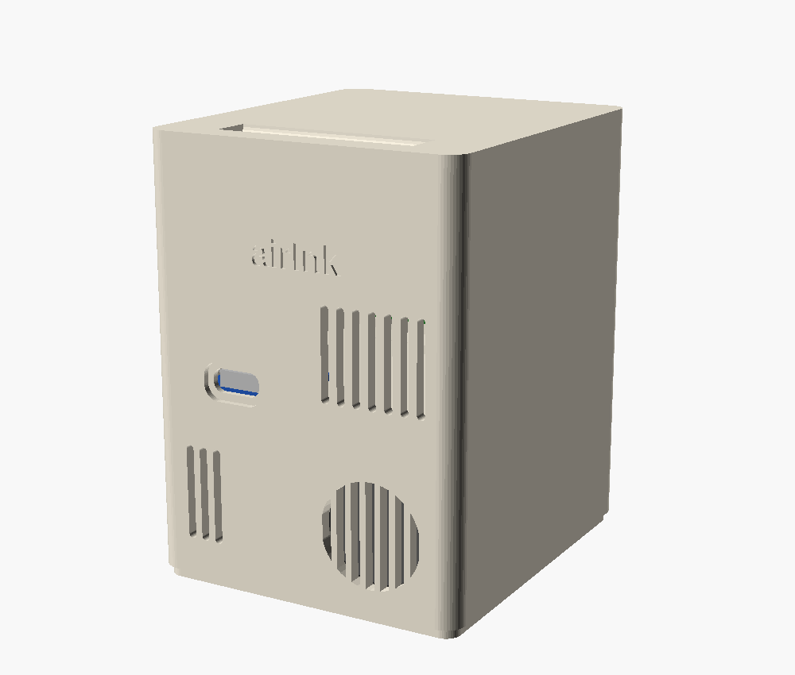
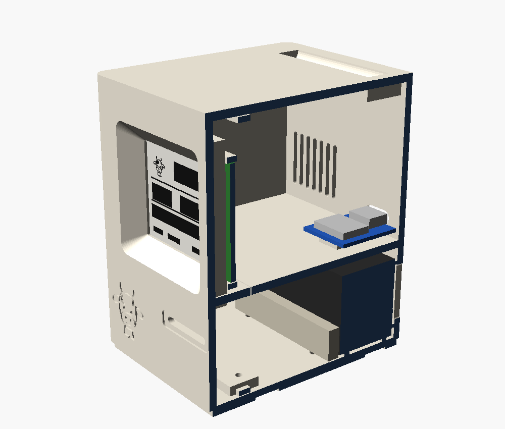

# airInk mini Mac case

A 3D-printable case in the style of the 1984 Macintosh, for the SEN66, the XIAO ESP32-C3 and the 1.54-inch e-paper module.



| Back | Cutaway |
|---|---|
|  |  |

Outer size: 64 × 72 × 86 mm (W × D × H).

## How it works

- **Sensor below, heat above.** The SEN66 lies in the base. A shelf separates it from the XIAO, whose heat rises out through the handle groove on top. Sensirion recommends placing the sensor below and away from heat sources.
- **Sealed airflow.** The sensor's inlet and outlet face lies against the back wall. Ribs around the inlet grille and the fan grille keep the outlet air from flowing straight back into the inlets. The grilles exceed Sensirion's minimum opening areas: about 89 mm² for the inlets (≥ 56 mm² required) and about 190 mm² for the outlet (≥ 148 mm² required).
- **The floppy slot** opens into the sensor chamber, so the case interior stays at ambient pressure.
- **The Chueli badge** sits where the original had its logo. It's the happy Chueli from the display, engraved as line art.

## Parts

| Part | Print orientation | Qty |
|---|---|---|
| `stl/shell.stl` | on its back, as exported | 1 |
| `stl/bezel.stl` | face down, as exported | 1 |
| `stl/sensor_clamp.stl` | as exported | 1 |
| `stl/display_clip.stl` | flat | 2 |

PLA or PETG, 0.2 mm layers, 3 walls, no supports. Beige or ivory filament gives the 1984 look.

## Hardware

- 4 × M2.5 × 8 mm self-tapping screws: 2 for the bezel, 2 for the sensor clamp
- 2 × M2 × 5 mm self-tapping screws for the display clips
- 4 × self-adhesive rubber feet, 8 mm diameter, up to 1 mm thick
- Double-sided foam tape for the XIAO
- A JST GH 6-pin cable for the SEN66, ideally shorter than 10 cm
- Optional: thin foam tape on the sealing ribs, and a scrap of foam to plug the cable pass-through in the shelf

## Measure before printing

The SEN66 dimensions come from the Sensirion datasheet. The other parts vary by supplier, so check them with calipers and adjust the parameters at the top of `mini-mac.scad`:

- **Display module:** `mod_w`, `mod_h` and `mod_t`. Also measure where the active area sits on your module, seen from the front: `aa_from_left` and `aa_from_top`. The defaults assume a 48 × 33 mm Waveshare module with the active area centred.
- **XIAO:** `xiao_lift` is 2.5 mm for wires soldered straight to the pads. Use about 9 mm if your XIAO has downward pin headers.

## Assembly

1. Solder the wires to the XIAO and the display. Plug the cable into the SEN66.
2. Slide the SEN66 in from the front, with its inlet/fan face against the back wall and the inlets on the right as seen from the front. Screw the clamp in from below. The slotted holes take up the sensor's tolerance.
3. Route the sensor cable up through the notch in the shelf.
4. Stick the XIAO onto its rib with the USB-C port pushed into the back-wall opening. Stick the XIAO's external antenna to the inside of the left wall.
5. Place the display in the bezel's corner guides and fix it with the two clips.
6. Slide the bezel onto the shell and screw it on from below. Add the rubber feet.

Once the display is mounted, you may need to change `rotation:` in `sen66-air-monitor.yaml` so the image is upright.

## Editing

Open `mini-mac.scad` in [OpenSCAD](https://openscad.org) to change parameters in the Customizer. Set `part` to `exploded` or `section` to look inside. To re-export a part:

```bash
openscad -D 'part="shell"' -o stl/shell.stl mini-mac.scad
```

## References

- [Sensirion SEN6x datasheet](https://sensirion.com/resource/datasheet/SEN6x): package outline and connector
- [SEN6x Mechanical Design and Assembly Guidelines](https://sensirion.com/media/documents/EA641247/682EF0DB/Sensirion_PS_AN_SEN6x_Mechanical_Design_and_Assembly_Guidelines.pdf): airflow sealing, orientation and heat sources
